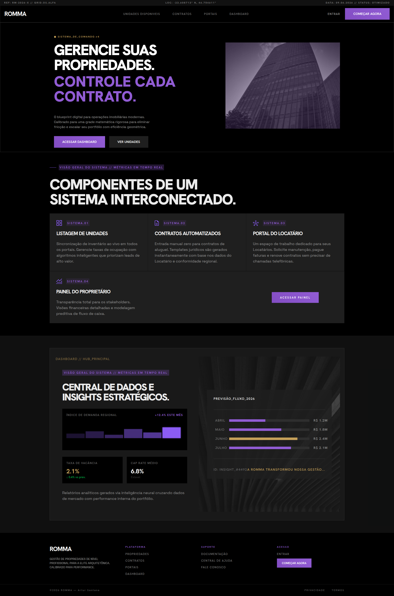
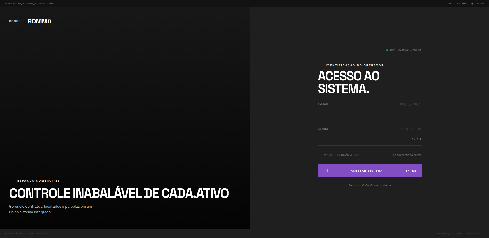
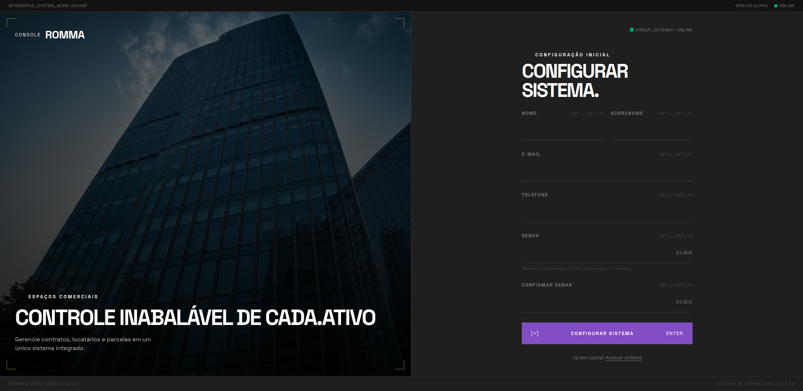
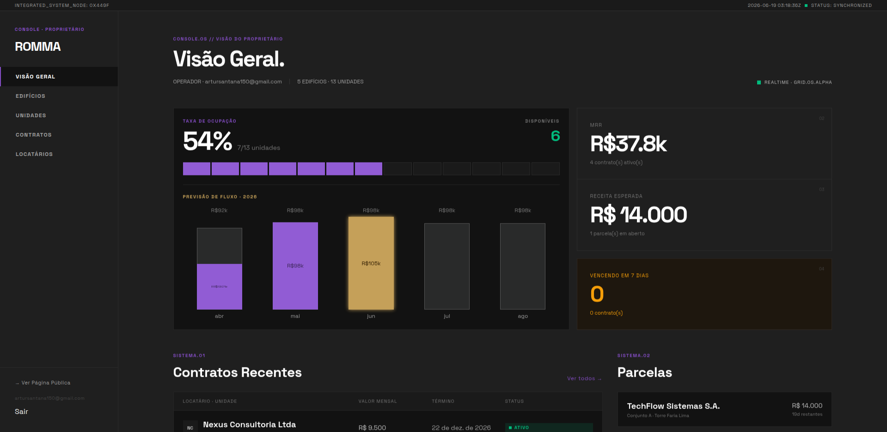
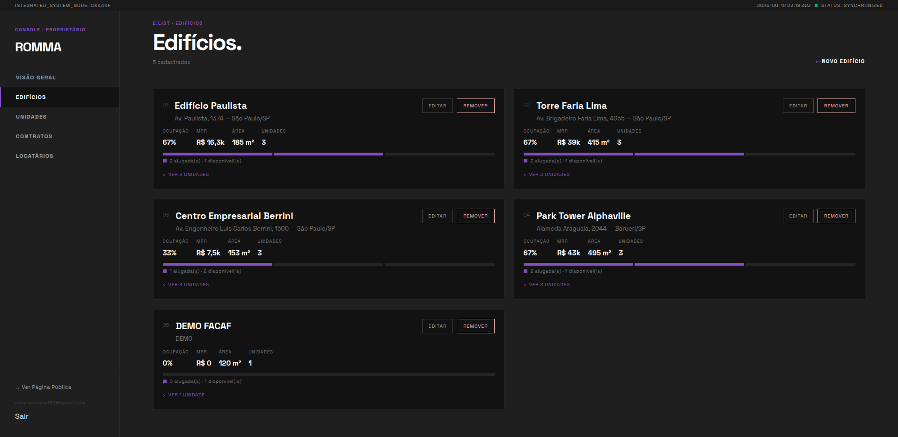
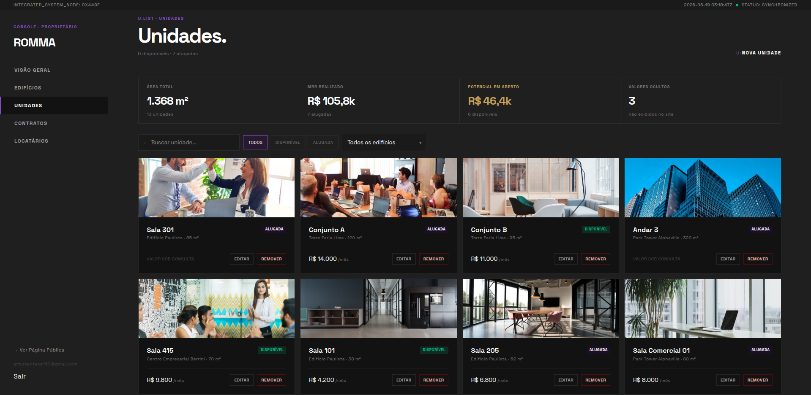
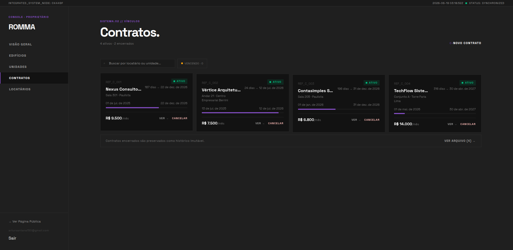
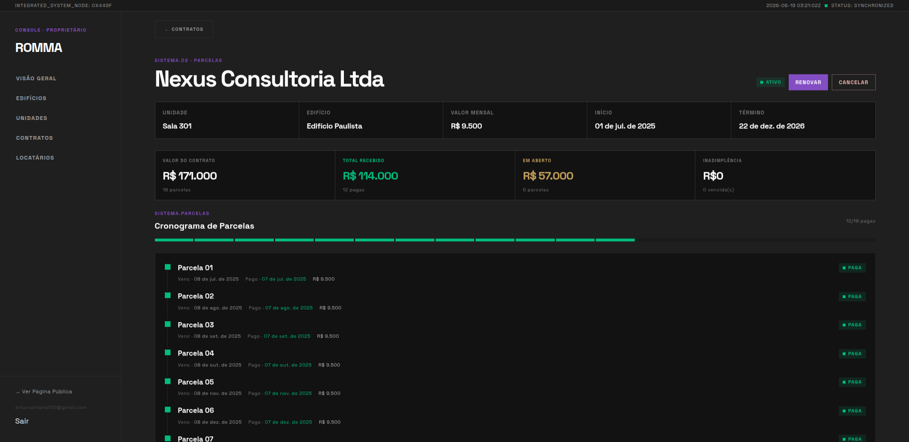
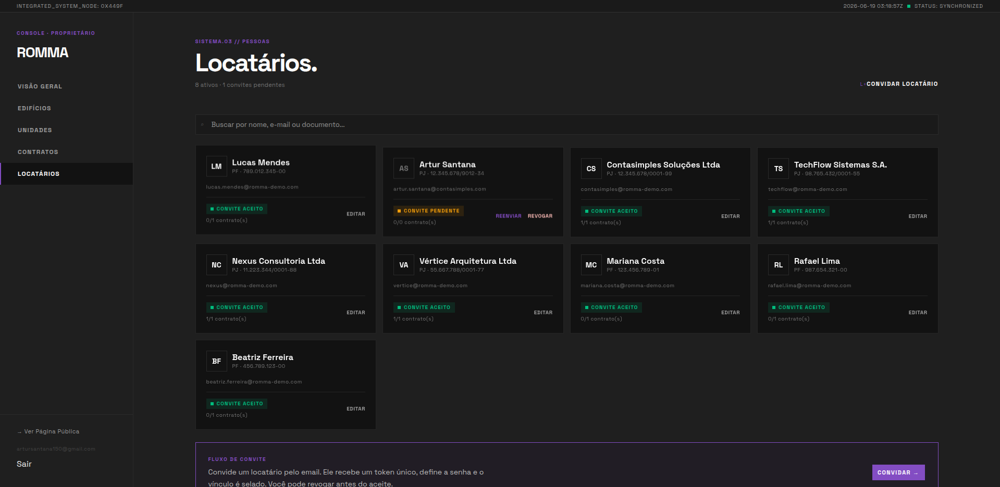
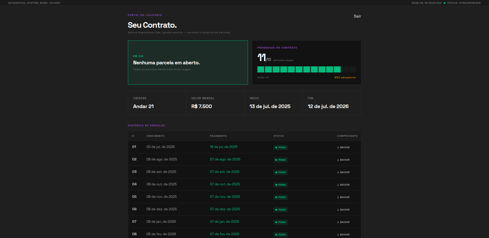

# Romma

**Sistema de gerenciamento de aluguéis corporativos** — desenvolvido como TCC de Engenharia da Computação.

Romma conecta um **Proprietário** (dono de edifícios) com **Locatários** (empresas ou pessoas físicas que buscam espaços comerciais), gerenciando o ciclo completo de uma locação: da listagem pública de Unidades disponíveis, passando pelos Contratos, até o acompanhamento das Parcelas mensais.

🔗 **Demo ao vivo:** [romma-alpha.vercel.app](https://romma-alpha.vercel.app)



---

## Sumário

- [Visão geral](#visão-geral)
- [Funcionalidades](#funcionalidades)
- [Telas](#telas)
- [Stack](#stack)
- [Arquitetura](#arquitetura)
- [Modelo de dados](#modelo-de-dados)
- [Regras de negócio](#regras-de-negócio)
- [Estrutura do projeto](#estrutura-do-projeto)
- [Configuração](#configuração)
- [Licença](#licença)

---

## Visão geral

O sistema é organizado em torno de três perfis de uso:

| Perfil | Acesso | O que faz |
|---|---|---|
| **Proprietário** | Painel administrativo (`/dashboard`) | Gerencia edifícios, unidades, contratos, parcelas e convida locatários. Único por instância. |
| **Locatário** | Portal restrito (`/portal`) | Visualiza o próprio contrato e o histórico de parcelas. Acesso via convite por email. |
| **Visitante** | Landing pública (`/`) | Vê as unidades disponíveis em tempo real e demonstra interesse. |

---

## Funcionalidades

### Proprietário

- Cadastro e gestão de **Edifícios** e **Unidades** (área, valor mensal e controle de visibilidade do preço)
- **Convite de Locatários por email** — o locatário recebe um token único, define a senha e o vínculo é selado (pode ser revogado antes do aceite)
- Criação e gestão de **Contratos** vinculando Locatários a Unidades
- Acompanhamento de **Parcelas** mensais com marcação de pagamento e cronograma visual
- **Dashboard** com métricas: taxa de ocupação, MRR, receita esperada, contratos ativos e parcelas pendentes/vencidas, com previsão de fluxo de caixa

### Locatário

- Visualização do **Contrato ativo** (unidade, valor, vigência, progresso de adimplência)
- **Histórico de Parcelas** (pagas, pendentes e vencidas) com download de comprovante

### Landing pública

- Listagem de Unidades disponíveis com **atualização em tempo real** via Supabase Realtime — unidades alugadas somem automaticamente
- Valor mensal exibido ou substituído por *"Consulte o Proprietário"* conforme configuração da unidade
- Formulário de contato para interesse em uma Unidade

---

## Telas

### Landing pública


### Acesso ao sistema
| Login | Configuração inicial |
|---|---|
|  |  |

### Painel do Proprietário

**Dashboard — Visão Geral**


**Edifícios**


**Unidades**


**Contratos**


**Detalhe do Contrato — cronograma de parcelas**


**Locatários**


### Portal do Locatário


---

## Stack

| Camada | Tecnologia |
|---|---|
| Framework | Next.js 16 (App Router) |
| Linguagem | JavaScript |
| UI | React 19 · Tailwind CSS v4 · shadcn/ui · Radix |
| Banco de dados | Supabase (PostgreSQL) |
| Autenticação | Supabase Auth (convite por email) |
| Segurança | Row-Level Security (RLS) por operação |
| Tempo real | Supabase Realtime |
| Edge Functions | Supabase Edge Functions (Deno) |
| Dev server | Turbopack (`next dev --turbopack`) |
| Deploy | Vercel |

---

## Arquitetura

Romma segue a separação Server/Client Components do App Router do Next.js 16:

- **Server Components** (`src/app/**/page.js`) — shells finos que importam um componente de feature.
- **Client Components** (`src/components/features/*.js`) — detêm todo o estado, data fetching e manipulação de eventos.
- **Server Actions** (`src/actions/*.js`) — todas as mutações; retornam `{ status }`.
- **Queries** (`src/lib/queries-*.js`) — funções puras, sem hooks, chamadas por `useEffect` (cliente) ou Server Actions (servidor).
- **Edge Functions** (`supabase/functions/`) — geração atômica de parcelas (`gerar-parcelas`) e envio de email (`enviar-email`).

> **Next.js 16:** o middleware foi renomeado para `proxy.js` (runtime Node.js). O arquivo do projeto fica em `src/proxy.js`.

### Autenticação e papéis

- **Um Proprietário por instância** (modelo de dono único). Verificação de papel via `supabase.rpc('is_proprietario')`.
- **Locatários** são convidados via `inviteUserByEmail` — existem em `auth.users` mas não têm acesso ao dashboard, apenas ao portal.
- **RLS** aplicada por operação (SELECT/INSERT/UPDATE/DELETE) — a ausência de uma política gera 403 apenas naquela operação.

---

## Modelo de dados

```
edificios
  └── unidades (1:N)
        └── contratos (1:N, no máx. 1 ativo por unidade)
              └── parcelas (1:N, geradas atomicamente na criação)

auth.users
  └── locatarios (1:1)
```

### Terminologia

| Conceito | Nome no sistema |
|---|---|
| Dono do prédio | Proprietário |
| Empresa/pessoa que aluga | Locatário |
| Prédio | Edifício |
| Espaço alugável | Unidade |
| Aluguel ativo | Contrato |
| Pagamento mensal | Parcela |

---

## Regras de negócio

- Uma Unidade só pode ter **um Contrato `ativo` por vez** — garantido por índice único parcial no banco.
- Ao criar um Contrato, a Unidade muda para `alugada`; ao encerrar ou cancelar, volta para `disponivel`.
- Todas as Parcelas de um Contrato são **geradas atomicamente** na criação, via Edge Function `gerar-parcelas`.
- **Status das parcelas é orientado por data:** ficam `futura` até a `data_fechamento` chegar, tornam-se `pendente` quando o fechamento chega, e `vencida` quando o vencimento passa sem pagamento.
- A primeira parcela tem regra especial de fechamento conforme o `data_inicio` cair ou não dentro da janela de 7 dias do mês.
- O `valor_mensal` do Contrato é sempre o mesmo cadastrado na Unidade.

---

## Estrutura do projeto

```
src/
├── app/                      # Rotas (App Router)
│   ├── page.js               # Landing pública
│   ├── login/  signup/       # Autenticação
│   ├── auth/                 # Confirmação e reset de senha
│   ├── unidades/             # Listagem pública de unidades
│   ├── dashboard/            # Painel do Proprietário
│   │   ├── edificios/  unidades/
│   │   ├── contratos/[id]/   # Detalhe do contrato
│   │   └── locatarios/
│   └── portal/dashboard/     # Portal do Locatário
├── actions/                  # Server Actions (mutações)
├── components/features/      # Client Components (estado + UI)
├── hooks/                    # Hooks de cliente (Realtime)
├── lib/                      # Clientes Supabase + queries
└── proxy.js                  # Middleware (Node.js runtime)

supabase/functions/
├── gerar-parcelas/           # Geração atômica de parcelas
└── enviar-email/             # Envio de email
```

---

## Configuração

### Pré-requisitos

- Node.js **20+**
- Conta no [Supabase](https://supabase.com)

### Variáveis de ambiente

Crie um arquivo `.env.local` na raiz (veja `.env.example`):

```env
NEXT_PUBLIC_SUPABASE_URL=
NEXT_PUBLIC_SUPABASE_ANON_KEY=
SUPABASE_JWT=        # JWT legado — autentica chamadas às Edge Functions
SUPABASE_ROLE_KEY=   # service role — server-only, nunca exposto ao client
SITE_URL=http://localhost:3000
```

### Instalação

```bash
npm install
npm run dev
```

Acesse [http://localhost:3000](http://localhost:3000).

---

## Licença

Distribuído sob a licença [MIT](LICENSE). Projeto acadêmico — TCC de Engenharia da Computação.
